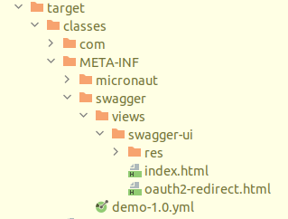
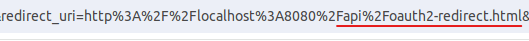

# Exemple Application 

This is a simple example of a Micronaut application with a simple REST API and a simple OAuth2 authentication
created for demonstrate how to reproduce the problem with the Micronaut OpenAPI plugin.

## Where complilation place Swagger pages

The Swagger pages are placed in the `META-INF/swagger/views/swagger-ui` directory.

## Cannot find the oauth2-redirect.html

When I clicked the Authorize button, the browser tried to redirect to `http://localhost:8080/api/oauth2-redirect.html` 
instead of `http://localhost:8080/api/swagger-ui/oauth2-redirect.html`.

Maybe the use of `/api` as context path is causing this problem, but that's just a guess.

